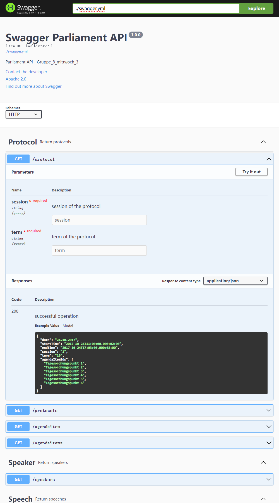
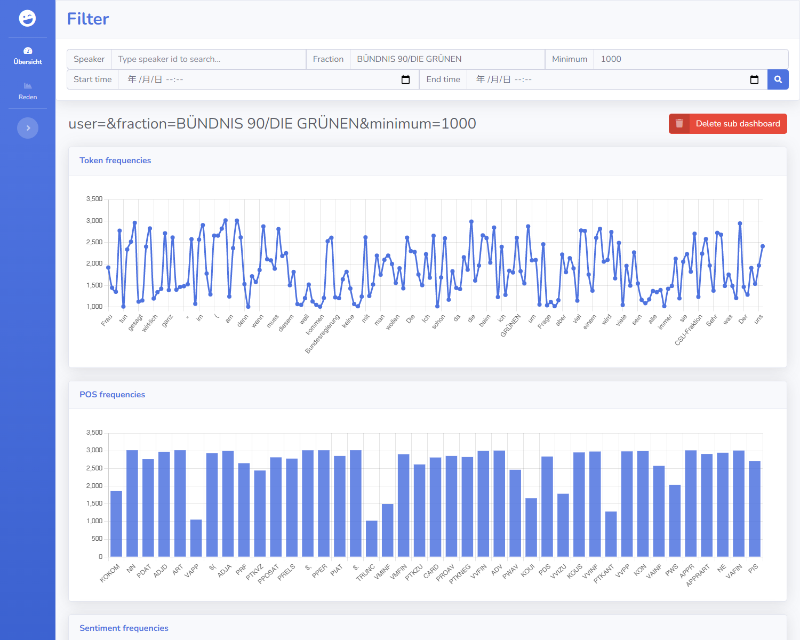
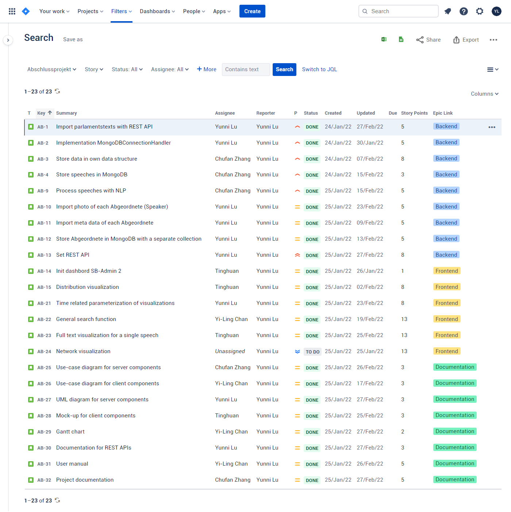

# Gruppe_8_Mittwoch_3_Parliamentsentimentradar

**Team members:**

- Lu, Yunni
    s0425513@stud.uni-frankfurt.de
- Zhang, Chufang
    s8295391@stud.uni-frankfurt.de
- Song, Tinghuan
    s6875719@stud.uni-frankfurt.de
- Chan, Yi-Ling
    s9728062@stud.uni-frankfurt.de

## Server

Run following commands in project directory:

- Read 19. and 20. plenary protocols from https://www.bundestag.de/services/opendata into mongodb

    ```shell
    docker run -it -p 4567:4567 --name AB-Backend -v $PWD/backend:/usr/src/backend -w /usr/src/backend maven:3.8.4-openjdk-17 mvn exec:java -D"exec.mainClass"="org.texttechnologylab.project.Gruppe_8_mittwoch_3.helper.ProtocolMongoDBWriter"
    ```

    - MongoDB config is defined in `./backend/config/config.json`

- Start REST service, default port = 4567

    ```shell
    docker run -d -p 4567:4567 --name AB-Backend -v $PWD/backend:/usr/src/backend -w /usr/src/backend maven:3.8.4-openjdk-17 mvn exec:java -D"exec.mainClass"="org.texttechnologylab.project.Gruppe_8_mittwoch_3.REST.RESTStarter"
    ```

- Run Swagger UI with docker

    ```shell
    docker run -d -p 8088:8080 --name swagger-ui -e SWAGGER_JSON=/swagger-ui/swagger.yml -v $PWD/swagger-ui:/swagger-ui swaggerapi/swagger-ui
    ```

    Enter http://localhost:8088/ to get access to the swagger-ui and see all available services

    

## Client

Open `./frontend/index.html` to open client dashboard, make sure that REST service is available on local machine! (See Server - start REST service)

### Overview



### Speeche - fulltext visualization


## Project organisation

### User stories



### Gantt Diagram


