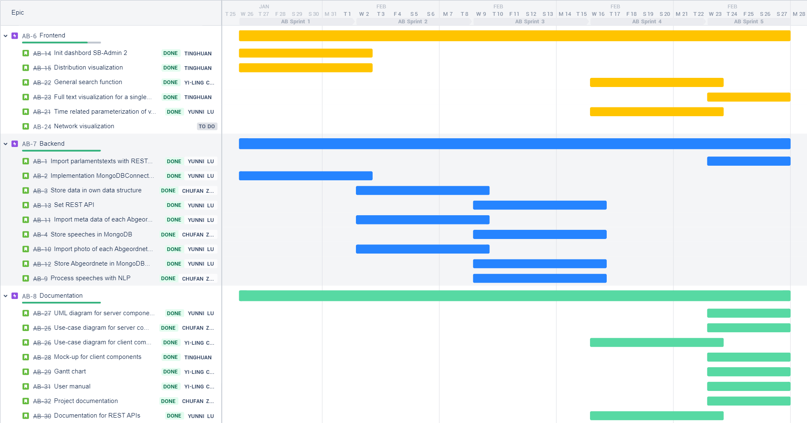

# Projektdokumentation

## Aufgabenverteilung

Wir haben dieses Abschlussprojekt in einer agilen Entwicklungsweise mit Hilfe von Jira durchgeführt. Zu Beginn des Projekts wurden einige User Stories entsprechend der Aufgabenbeschreibung erstellt. Jede User Story entspricht grundsätzlich einem kleinen Punkt in der Aufgabenbeschreibung und kann nach Epic (Backend, Frontend, Dokumentation) unterteilt werden. Der Zeit-/Schwierigkeitsaufwand für jede User Story wird durch Story Points bestimmt und wurde durch eine Abstimmung in der Gruppe bewertet. Auf diese Weise können wir die Arbeitsbelastung jedes Einzelnen leicht einschätzen und den Entwicklungsfortschritt des Projekts im Auge behalten.

Alle User Stories und die dazugehörigen Metadaten sind in der folgenden Tabelle aufgeführt.

## Projektablauf

Unser Abschlussprojekt begann am 26.01.2022 und endete am 27.02.2022. Das gesamte Projekt besteht aus 5 Sprints. Da wir insgesamt nur einen Monat Zeit hatten, wurde der Sprint auf eine Woche verkürzt. Der Projektablauf wird klar auf dem Gantt-Diagramm dargestellt.

Im Allgemeinen erledigen wir diese Aufgaben in der Reihenfolge Backend-Frontend-Dokumentation, da das Frontend auf den REST-Services und die vom Backend gelesenen Protokolldaten angewiesen ist. 