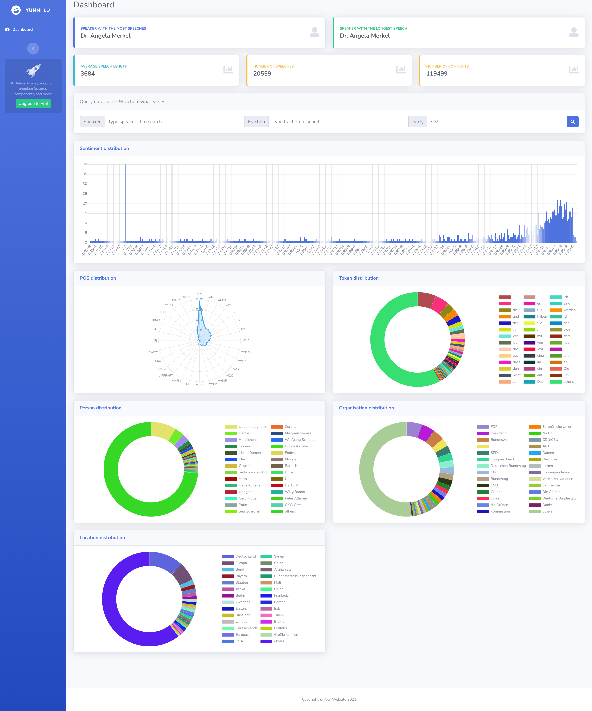
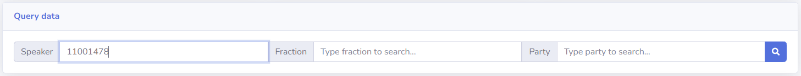
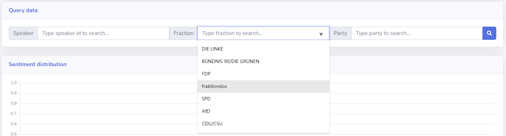
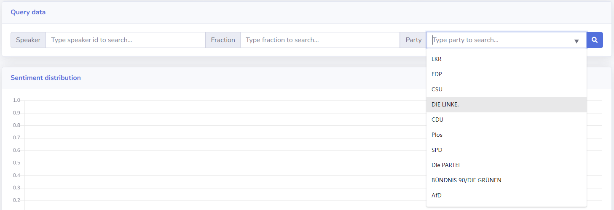
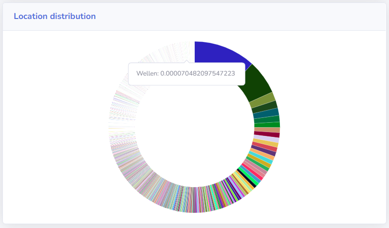
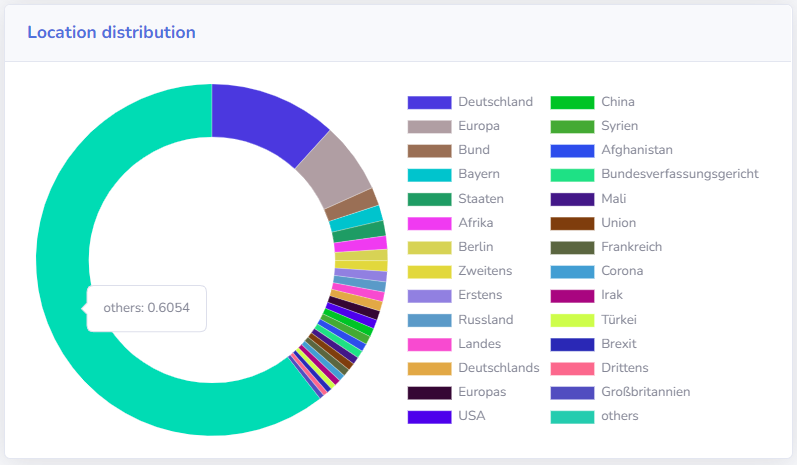

# Übung 3 - Dashboard

In this exercise, previously analyzed parliamentary protocols will be visualized.

## Preview

## Usage

### Filter results by speaker/ fraction/ party

- filter by speaker

    

- filter by fraction

    

- filter by party

    

### Chart design

It is worth noting that since we have too many token/name entities that cannot all be displayed in the doughnut chart, labels with too low percentage are merged into “others”. Tags with too low a frequency are almost impossible to locate in the chart. I think the merging approach will help us to better focus on the more dominant tags. Another advantage is that the more frequent tags can be listed next to the chart.

- **original data without merging**

    

- **processed data after merging**

    

## Use case diagram

## Note for author

This uebung is finished by `Yunni Lu`, s0425513@stud.uni-frankfurt.de alone. `rbforelle`, rbforelle@gmail.com is my default anonymous account. The git config was not set properly at the very beginning, changes were committed by rbforelle@gmail.com and pushed to the remote. Since I can’t force change pushed commits in master branch, author of the old commits can not be corrected anymore.

